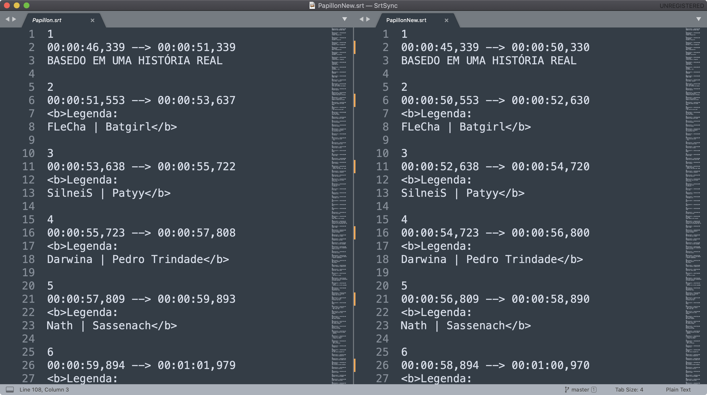

🦁 **SrtSync** is a simple delay editor for .srt files to produce permanent synchronization with movies.

## Example of Usage

* Papillon.srt => Input File
* -10000 => Delay (miliseconds)
* PapillonNew.srt => Output File

`ruby srtsync.rb Papillon.srt -1000 PapillonNew.srt`

### Result

by: [juninhoojl](http://github.com/juninhoojl)
